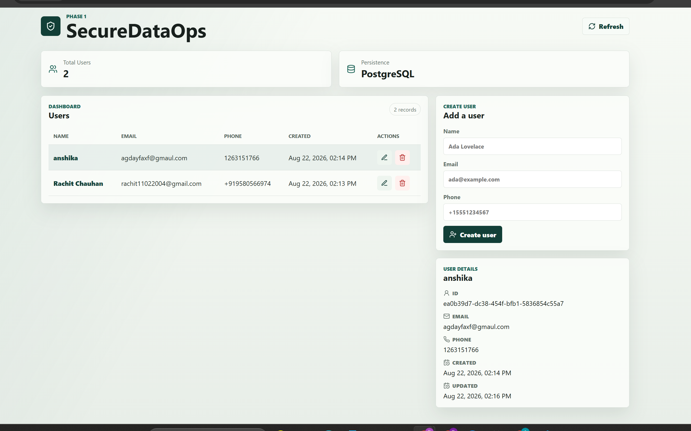

Yes. For your SecureDataOps project, I’d make the README look like a proper production project README, with the image paths already included.

I’ll assume your images are stored like this:

securedataops/
├── backend/
├── frontend/
├── docs/
│   └── images/
│       ├── architecture.png
│       ├── aws-architecture.png
│       ├── dashboard.png
│       ├── login.png
│       └── ...
└── README.md

Here is a suitable README:

SecureDataOps README
SecureDataOps

SecureDataOps is a secure data management and compliance platform designed to help organizations manage sensitive data while following the principles of the Digital Personal Data Protection (DPDP) Act, 2023.

The platform provides a centralized system for managing data, monitoring access, identifying sensitive information, and supporting privacy and compliance workflows.

📌 Project Overview

Organizations handle large amounts of personal and sensitive information every day. Managing this data securely while maintaining compliance can be difficult when data is distributed across different systems.

SecureDataOps aims to provide a unified platform where organizations can:

Manage and monitor sensitive data
Identify personal and sensitive information
Control data access
Maintain visibility over data operations
Support privacy and compliance workflows
Monitor security-related activities
Provide a centralized dashboard for administrators
🏗️ System Architecture

The application follows a modern full-stack architecture using a frontend, backend API, database, containerization, and AWS infrastructure.

High-Level Flow
User
  │
  ▼
Frontend
  │
  ▼
Application Load Balancer
  │
  ▼
Backend API
  │
  ├── Authentication
  ├── Data Management
  ├── Compliance
  ├── Security
  └── Analytics
  │
  ▼
Database
☁️ AWS Deployment Architecture

The application is containerized using Docker and deployed using AWS services.

The deployment includes components such as:

Amazon ECR for container images
Amazon ECS for containerized application deployment
Application Load Balancer for traffic routing
AWS networking infrastructure
Backend API service
Frontend service
Database infrastructure
✨ Key Features
🔐 Secure Data Management

Manage organizational data through a centralized platform with controlled access and secure processing.

👤 Data Subject Management

Support workflows related to individuals whose personal data is being processed.

📋 Consent Management

Track and manage consent-related information for personal data processing.

🔎 Data Discovery

Identify and classify personal or sensitive information within organizational data.

🛡️ Access Control

Provide controlled access to application resources based on user roles and permissions.

📊 Compliance Dashboard

Provide administrators with a centralized view of data, compliance activities, and security-related information.

📝 Audit & Monitoring

Maintain visibility into important activities performed within the platform.

🖥️ Application Screenshots
Login

Dashboard

Data Management

Compliance

Replace any screenshot filename above with the actual filename if your image has a different name.

🧩 Technology Stack
Frontend
React.js
JavaScript / TypeScript
HTML5
CSS
Vite
Backend
Python
FastAPI
REST APIs
Pydantic
Database
PostgreSQL
DevOps & Deployment
Docker
Amazon ECR
Amazon ECS
Application Load Balancer
AWS
Development Tools
Git
GitHub
Docker Desktop
AWS CLI
📂 Project Structure
securedataops/
│
├── backend/
│   ├── app/
│   ├── requirements.txt
│   ├── Dockerfile
│   └── ...
│
├── frontend/
│   ├── src/
│   ├── public/
│   ├── package.json
│   ├── Dockerfile
│   └── ...
│
├── docs/
│   └── images/
│       ├── architecture.png
│       ├── aws-architecture.png
│       ├── dashboard.png
│       ├── login.png
│       ├── data-management.png
│       └── compliance.png
│
├── .gitignore
├── README.md
└── ...
🚀 Running the Project Locally
1. Clone the Repository
git clone <your-github-repository-url>
cd securedataops
2. Backend Setup

Navigate to the backend:

cd backend

Create and activate a virtual environment:

python -m venv venv

On Windows:

venv\Scripts\activate

Install dependencies:

pip install -r requirements.txt

Start the backend:

uvicorn app.main:app --reload

The backend API will normally be available at:

http://localhost:8000
3. Frontend Setup

Open another terminal:

cd frontend

Install dependencies:

npm install

Start the development server:

npm run dev

The frontend will normally be available at:

http://localhost:5173
🐳 Docker

The project can also be containerized using Docker.

Build Backend
docker build -t securedataops-backend ./backend
Build Frontend
docker build -t securedataops-frontend ./frontend

The containers can then be deployed to the AWS infrastructure.

☁️ AWS Deployment

The production deployment uses containerized services.

Deployment Flow
Local Source Code
       │
       ▼
Docker Build
       │
       ▼
Amazon ECR
       │
       ▼
Amazon ECS
       │
       ▼
Application Load Balancer
       │
       ▼
Users
Container Images

The application images are stored in Amazon ECR and deployed through ECS.

Note: The existing frontend ECR repository is named securedatops-frontend and intentionally retains this spelling because it is already deployed. The intended project naming is securedataops, but the existing repository should not be renamed in deployment commands.

🔒 Security & Privacy

Security is a core part of SecureDataOps.

The platform is designed around principles such as:

Least-privilege access
Authentication and authorization
Secure API communication
Controlled access to sensitive information
Auditability of important operations
Secure container deployment
Protection of application secrets
Privacy-aware data processing

Secrets and credentials should never be committed directly to the Git repository.

Use environment variables or a secure secrets-management solution instead.

🇮🇳 DPDP Act Alignment

SecureDataOps is designed to support organizational workflows related to India's Digital Personal Data Protection Act, 2023.

The platform can help organizations operationalize concepts such as:

Personal data management
Consent management
Data principal rights
Purpose-aware data processing
Data security
Data retention considerations
Data breach response workflows
Audit and accountability

SecureDataOps is a technology platform intended to support compliance operations. It does not itself constitute legal advice or guarantee legal compliance.

📊 Compliance Workflow
Data Collection
      │
      ▼
Data Identification
      │
      ▼
Data Classification
      │
      ▼
Consent & Purpose Management
      │
      ▼
Access Control
      │
      ▼
Monitoring & Auditing
      │
      ▼
Compliance Review
🧪 Development

Before pushing changes, verify the application locally.

Backend
python -m pytest
Frontend
npm run build
Git Workflow
git status
git add .
git commit -m "Describe your changes"
git push
📸 Documentation Images

Project documentation images are maintained inside:

docs/images/

Recommended image naming:

docs/images/
├── architecture.png
├── aws-architecture.png
├── login.png
├── dashboard.png
├── data-management.png
└── compliance.png

Images can be referenced from this README using relative Markdown paths:

🔮 Future Improvements

Potential future improvements include:

Advanced data classification
Automated PII detection
Data lineage visualization
Automated compliance reports
More granular role-based access control
Security event monitoring
Data retention automation
Improved audit trails
Automated compliance assessments
Integration with enterprise data sources
👨‍💻 Project

SecureDataOps

A secure data management and privacy compliance platform built to help organizations manage personal data and operationalize privacy requirements.

📄 License

Add the appropriate project license here.

For example:

MIT License

if the project is intended to be released under the MIT License.

Pasted markdown(20260823-090318).md
File
in this you haven't put markdown right?

Yes — I did put Markdown in the README I gave you. The #, ##, , code fences, tables, bullets, etc. are all Markdown.

But I understand what you're asking now: you want the README shortened from the exact README you uploaded, while keeping the Markdown image syntax and using your actual images in docs/images/ at the same places/sections.

And looking at the content you pasted, there is a problem: the uploaded README has the image locations but the actual image Markdown is missing/blank in several places. For example:

## Architecture

is what needs to be present—not just an empty space after the heading.

Also, your actual filenames from the README are:

alarm.png
austoscaling.png
auto-scaling-terminal.png
backend-service.png
backend-tg.png
cicdbackend.png
cicdfrontend.png
cluster.png
dashboard.png
databaseRDS.png
frontend-service.png
frontend-task.png
health-check.png
logs.png
logsdashboard.png
s3.png
target-groups.png
teraform-validate.png
tests.png
Vpc.png

So the paths must match exactly, including capitalization and the austoscaling / teraform spellings.

For example:

## AWS Networking

## Application

### Frontend

### Backend

## ECS Cluster

## Load Balancing

## Database

## CI/CD

### Backend CI/CD

### Frontend CI/CD

## Terraform Validation

## Observability

## Auto Scaling

## Health and Reliability

## Testing

## Infrastructure State

One important thing

Your current README says:

docs/images/architecture.png

but architecture.png is not in the list of images you gave me.

So don't use that path unless that file actually exists.

The safest approach is to make the shortened README use only the 20 image files that you actually have, with the images placed in the same relevant sections as your current README.

If you want, I can now take the exact uploaded README, shorten it to a clean portfolio-sized ~400–600 lines, and preserve all 20 of your actual screenshots with proper Markdown paths.

Pasted markdown(20260823-090429).md
File
Pasted markdown (2).md
File
there are 2 files first that you gave me  and second that i made which was 2 long use this and generate me a not long but not too short i mwan readme should contain every imp architecture and how things are working + add markdowns too in it... take my readme as refernce where should be the images and give me a readme downloadable that i can just copy paste

Yes — I used both files you provided: the earlier shorter README and your much longer README as the detailed reference.

I made the new version medium-length rather than extremely long or too short. It keeps the important:

AWS architecture and request flow
VPC/networking
ECS Fargate
ALB + target groups + health checks
RDS PostgreSQL
ECR + Docker
Terraform + S3 state
GitHub Actions CI/CD
GitHub OIDC + IAM
DevSecOps / pip-audit
JWT authorization
CloudWatch + SNS
Auto Scaling
Backup/DR
DPDP-oriented controls
Incident management/SRE
Verification
Repository structure
Local development

And I added actual Markdown image references using your real docs/images/ filenames, including Vpc.png, cluster.png, backend-service.png, databaseRDS.png, cicdbackend.png, austoscaling.png, logs.png, etc.

Download the ready-to-use README

Download README.md

You can simply:

Download it.
Rename/replace your existing README.md.

Make sure it is at the root of your repository:

secure-data-platform/
├── README.md
└── docs/
    └── images/
        ├── Vpc.png
        ├── dashboard.png
        ├── ...

Then:

git add README.md
git commit -m "docs: update portfolio README"
git push

Important: I did not invent image filenames for screenshots you don't currently have. I used the actual image names from your provided README/reference.

README.md
Document

README.md
SecureDataOps

A production-oriented DevOps, SRE, and DevSecOps platform demonstrating how a containerized full-stack application is deployed, secured, monitored, scaled, and recovered on AWS.

Overview

SecureDataOps is a full-stack application built with React/Vite, FastAPI, PostgreSQL, Docker, Terraform, GitHub Actions, and AWS.

The project demonstrates the complete production lifecycle:

Developer
   ↓
GitHub
   ↓
GitHub Actions
   ├── Tests
   ├── Security Validation
   └── Terraform Validation
   ↓
Docker Build
   ↓
Amazon ECR
   ↓
Amazon ECS Fargate
   ↓
Application Load Balancer
   ↓
PostgreSQL / Amazon RDS
   ↓
CloudWatch + SNS
   ↓
Auto Scaling
   ↓
Backup / Disaster Recovery
What this project demonstrates
AWS cloud architecture and networking
Docker containerization
ECS Fargate deployment
Application Load Balancing
Amazon ECR
Amazon RDS PostgreSQL
Terraform Infrastructure as Code
GitHub Actions CI/CD
GitHub OIDC → AWS IAM
Dependency security scanning with pip-audit
JWT authentication and authorization
CloudWatch logs, metrics, and alarms
SNS notifications
ECS request-based Auto Scaling
Backup and disaster recovery
DPDP-oriented privacy engineering
Incident management, runbooks, and SLOs
Architecture
High-level architecture
                              INTERNET
                                  |
                    +-------------+-------------+
                    |                           |
                    v                           v
             Frontend ALB                 Backend ALB
                    |                           |
                    v                           v
             Frontend ECS                 Backend ECS
                                                  |
                                                  v
                                           PostgreSQL RDS

                    AWS VPC / NETWORKING
             VPC → Subnets → Security Groups

CI/CD:
Developer → GitHub → GitHub Actions → Docker → ECR → ECS

Observability:
ECS / ALB / Application → CloudWatch → SNS

Infrastructure:
Terraform → AWS

Terraform State:
Terraform → S3 → Encryption + Versioning + Lifecycle

Architecture evidence: The repository's AWS/VPC and service screenshots are included in the sections below.

AWS Infrastructure
VPC and Networking

The workload runs within an AWS VPC using subnets, routing, security groups, and availability-zone-aware infrastructure.

The intended application path is:

Internet
   ↓
Application Load Balancer
   ↓
ECS Fargate
   ↓
PostgreSQL RDS

The database is treated as a stateful data layer rather than a public application endpoint.

Network access model
Internet
   ↓
Frontend ALB → Frontend ECS

Internet
   ↓
Backend ALB → Backend ECS → PostgreSQL RDS

Security Groups control the allowed communication between these layers.

ECS Fargate

Frontend and backend run as separate ECS services.

ECS Cluster
├── Frontend Service
│   └── Frontend Task
│
└── Backend Service
    └── Backend Task

The services run on AWS Fargate, avoiding the need to manage EC2 servers.

Backend service

Frontend service

The deployed services were verified with the expected running task state.

Application Load Balancing

Separate ALB/target-group paths are used for the frontend and backend.

Frontend ALB
    ↓
Frontend Target Group
    ↓
Frontend ECS

Backend ALB
    ↓
Backend Target Group
    ↓
Backend ECS

Backend target group

ALB health checks continuously evaluate whether ECS tasks are healthy enough to receive traffic.

Application
Frontend

The frontend is implemented with React/Vite and deployed as a Dockerized ECS Fargate service.

Its responsibilities include the application UI and communication with the backend APIs.

Backend

The backend is implemented with FastAPI and provides REST APIs for application operations, authentication, authorization, health checks, privacy operations, and database access.

Database

The application uses PostgreSQL on Amazon RDS for persistent data.

The application stores user-related information such as:

UUID
Name
Email
Optional phone
Timestamps

Verified database controls include:

PostgreSQL
Automated backup retention
Encryption
Multi-AZ
Point-in-time recovery availability
Request Flow

A normal backend request follows:

User
 ↓
Backend ALB
 ↓
ALB Listener
 ↓
Backend Target Group
 ↓
Backend ECS Task
 ↓
FastAPI
 ↓
PostgreSQL RDS
 ↓
Response

The frontend follows:

User Browser
 ↓
Frontend ALB
 ↓
Frontend Target Group
 ↓
Frontend ECS Task
 ↓
React Application

When the frontend needs application data, it communicates with the backend API, which then interacts with PostgreSQL.

Containerization and ECR

Both application services are containerized with Docker.

Application Source
      ↓
Docker Build
      ↓
Docker Image
      ↓
Amazon ECR
      ↓
ECS Task Definition
      ↓
ECS Fargate

Containerization provides reproducible environments, dependency isolation, consistent deployment artifacts, and easier rollback.

Infrastructure as Code

Terraform is used to manage and validate infrastructure such as:

ECS
ECR
ALB
Target Groups
IAM
Application Auto Scaling
Terraform state configuration

The normal workflow is:

Terraform Code
    ↓
terraform fmt
    ↓
terraform validate
    ↓
terraform plan
    ↓
Review
    ↓
terraform apply
    ↓
AWS
Terraform validation

Terraform State

Terraform state is stored remotely in Amazon S3.

Verified controls include:

S3 Versioning: Enabled
Encryption: AES256
Noncurrent version retention: 365 days

This protects the Terraform state from accidental loss and preserves historical state versions.

CI/CD

GitHub Actions automates testing, security validation, Terraform validation, image building, and deployment.

Backend CI/CD

Frontend CI/CD

Deployment flow
Developer
   ↓
GitHub
   ↓
GitHub Actions
   ├── Tests
   ├── pip-audit
   └── Terraform validation
   ↓
Docker Build
   ↓
Amazon ECR
   ↓
Amazon ECS
   ↓
ALB Health Check
   ↓
Running Service
GitHub OIDC and IAM

CI/CD uses GitHub OIDC rather than storing long-lived AWS access keys in the repository.

GitHub Actions
      ↓
GitHub OIDC Token
      ↓
AWS IAM Trust Policy
      ↓
Deployment / Validation Role
      ↓
Temporary AWS Credentials
      ↓
AWS APIs

This reduces the need for permanent AWS credentials in CI/CD and supports a more secure deployment model.

DevSecOps

Security is applied across development, CI/CD, and runtime.

Code
 ↓
Tests
 ↓
Security Validation
 ↓
Terraform Validation
 ↓
Docker Build
 ↓
ECR
 ↓
ECS Runtime

Security-related controls include:

IAM
GitHub OIDC
JWT authorization
Dependency scanning
Secure configuration
RDS encryption
S3 encryption
Privacy-aware logging
Dependency scanning

pip-audit is used to identify vulnerable Python dependencies.

During development, a vulnerable PyJWT version was identified, upgraded, and revalidated.

Final validation:

26 tests passed
pip-audit: No known vulnerabilities found

Authentication and Authorization

Privacy-sensitive user endpoints require bearer JWT authorization.

Protected operations include:

GET    /api/v1/users/{user_id}
GET    /api/v1/users/{user_id}/export
PUT    /api/v1/users/{user_id}
DELETE /api/v1/users/{user_id}

JWTs contain claims such as:

sub
iss
aud
exp

Expected authorization behavior:

Missing / invalid / expired token → 401
Cross-user access               → 403
Valid authorized request        → Allowed
Observability

The platform uses CloudWatch for logs, metrics, dashboards, and alarms, with SNS for notifications.

Application / ECS / ALB
          ↓
      CloudWatch
       ↓      ↓
     Logs   Alarms
              ↓
             SNS
              ↓
        Notification
Logs

Monitoring dashboard

Alerting

This creates an operational path from detection to notification instead of relying only on manual inspection.

Auto Scaling

The backend ECS service uses Application Auto Scaling based on ALB request load.

Verified configuration
Configuration	Value
Minimum capacity	1
Maximum capacity	3
Metric	ALBRequestCountPerTarget
Target	100
Scale-out cooldown	60 seconds
Scale-in cooldown	300 seconds

Scaling flow
Incoming Requests
      ↓
Backend ALB
      ↓
ALBRequestCountPerTarget
      ↓
Application Auto Scaling
      ↓
ECS Tasks
   ↙       ↘
Scale Out  Scale In
Health and Reliability

The backend exposes:

GET /health

Expected response:

{
  "status": "healthy"
}

The production health endpoint and ALB target health were verified.

The ALB removes unhealthy targets from normal traffic, while ECS can replace unhealthy tasks.

Backup and Disaster Recovery

RDS is treated as a critical stateful component.

PostgreSQL RDS
      ↓
Automated Backups
      ↓
Point-in-Time Recovery
      ↓
Isolated Restore
      ↓
Validation
      ↓
Approved Recovery / Cutover

The Terraform state has an additional protection layer:

Terraform
   ↓
S3
   ├── Encryption
   ├── Versioning
   └── 365-day noncurrent-version retention

Detailed recovery procedures are maintained in:

docs/BACKUP-DR.md

DPDP-Oriented Privacy Controls

SecureDataOps processes personal data such as:

Name
Email
Optional phone
UUID
Timestamps

The project implements engineering controls around the data actually processed by the application.

Privacy operations
Data Access
Data Export
Data Correction
Data Erasure

Protected operations include:

GET    /api/v1/users/{user_id}/export
PUT    /api/v1/users/{user_id}
DELETE /api/v1/users/{user_id}

The project also uses:

Authorization
Minimal privacy audit events
Privacy-aware logging
Reduced logging of unnecessary personal data
Data inventory and purpose mapping

Detailed documentation:

docs/DPDP.md

Important: SecureDataOps demonstrates DPDP-oriented engineering controls. It is not a legal certification or a claim of complete DPDP compliance. Formal requirements such as lawful basis, notice/consent, retention, grievance handling, identity verification, and organizational procedures require appropriate legal review.

Incident Management and SRE

The project treats operations as a continuous lifecycle:

Detect
  ↓
Triage
  ↓
Mitigate
  ↓
Recover
  ↓
Validate
  ↓
Postmortem
  ↓
Prevent Recurrence

Operational documentation:

docs/incident-management.md
docs/runbooks.md
docs/slo.md
Example: unhealthy ECS task
Task becomes unhealthy
        ↓
ALB health check fails
        ↓
Traffic removed
        ↓
ECS replaces task
Example: increased traffic
Traffic increases
        ↓
ALB request count increases
        ↓
Auto Scaling threshold reached
        ↓
Additional ECS task
Example: vulnerable dependency
Dependency
   ↓
pip-audit
   ↓
Vulnerability
   ↓
CI failure
   ↓
Upgrade dependency
   ↓
Tests + audit
   ↓
Pipeline passes
Verification

The deployed environment was verified across application, infrastructure, security, and operations.

Area	Verification
Backend tests	26 passed
Dependency audit	No known vulnerabilities
Terraform	Validation passed
ECS	Services deployed
ALB	Targets healthy
Backend health	HTTP 200
Auto Scaling	Verified
RDS backups	Verified
RDS encryption	Enabled
RDS Multi-AZ	Enabled
S3 versioning	Enabled
S3 encryption	Enabled
S3 lifecycle	365-day retention
Repository Structure
secure-data-platform/
│
├── backend/
│   ├── app/
│   ├── tests/
│   ├── Dockerfile
│   └── requirements.txt
│
├── frontend/
│   ├── src/
│   ├── Dockerfile
│   └── ...
│
├── infra/
│   └── terraform/
│
├── docs/
│   ├── BACKUP-DR.md
│   ├── DPDP.md
│   ├── incident-management.md
│   ├── runbooks.md
│   ├── slo.md
│   └── images/
│
├── .github/
│   └── workflows/
│
└── README.md
Documentation
Document	Purpose
docs/DPDP.md	DPDP-oriented privacy controls
docs/BACKUP-DR.md	Backup and disaster recovery
docs/incident-management.md	Incident lifecycle
docs/runbooks.md	Operational troubleshooting
docs/slo.md	Reliability targets
infra/terraform/README.md	Infrastructure documentation
Local Development
Backend
cd backend
python -m venv venv

Windows:

venv\Scripts\activate

Install dependencies:

pip install -r requirements.txt

Run:

uvicorn app.main:app --reload
Frontend
cd frontend
npm install
npm run dev
Docker

Backend:

docker build -t securedataops-backend ./backend

Frontend:

docker build -t securedataops-frontend ./frontend
Production Readiness Considerations

The project demonstrates production-oriented engineering practices, but a real enterprise deployment may require additional controls depending on business and regulatory requirements.

Potential future improvements include:

Managed enterprise identity provider
Asymmetric/JWKS-backed JWT validation
Formal secret rotation
HTTPS/TLS everywhere
AWS WAF
Stronger private-network isolation
Centralized security monitoring
Formal penetration testing
Regular DR restore exercises
Multi-region recovery where required
Cost monitoring and optimization

These are intentionally presented as future considerations rather than claimed as already implemented.

What This Project Demonstrates
AWS / Cloud

VPC · Subnets · Security Groups · ALB · ECS Fargate · ECR · RDS · S3 · IAM · CloudWatch · SNS

DevOps

Docker · GitHub · GitHub Actions · Terraform · CI/CD · Infrastructure as Code

DevSecOps

OIDC · IAM · JWT · Authorization · Dependency Scanning · Secure Configuration

SRE

Health Checks · Monitoring · Alerting · Auto Scaling · SLOs · Incident Management · Runbooks · Backup/DR

Data Protection

Data Inventory · Export · Correction · Erasure · Auditability · DPDP-oriented Controls

Project Philosophy
Build
 ↓
Automate
 ↓
Secure
 ↓
Deploy
 ↓
Observe
 ↓
Scale
 ↓
Recover
 ↓
Improve

SecureDataOps demonstrates that production-oriented DevOps is not simply about getting an application running. It is about making the system automated, observable, secure, scalable, recoverable, and maintainable.

Author

Rachit Singh Chauhan

B.Tech — Computer Science (AI & ML)

Interests: DevOps · SRE · DevSecOps · AWS · Cloud Infrastructure · IaC · CI/CD · AI/ML Systems
