# SecureDataOps

> A production-oriented DevOps, SRE, and DevSecOps platform demonstrating how a containerized full-stack application is deployed, secured, monitored, scaled, and recovered on AWS.

## Overview

**SecureDataOps** is a full-stack application built with **React/Vite, FastAPI, PostgreSQL, Docker, Terraform, GitHub Actions, and AWS**.

The project demonstrates the complete production lifecycle:

```text
Developer
   ↓
GitHub
   ↓
GitHub Actions
   ├── Tests
   ├── Security Validation
   └── Terraform Validation
   ↓
Docker Build
   ↓
Amazon ECR
   ↓
Amazon ECS Fargate
   ↓
Application Load Balancer
   ↓
PostgreSQL / Amazon RDS
   ↓
CloudWatch + SNS
   ↓
Auto Scaling
   ↓
Backup / Disaster Recovery
```

### What this project demonstrates

- AWS cloud architecture and networking
- Docker containerization
- ECS Fargate deployment
- Application Load Balancing
- Amazon ECR
- Amazon RDS PostgreSQL
- Terraform Infrastructure as Code
- GitHub Actions CI/CD
- GitHub OIDC → AWS IAM
- Dependency security scanning with `pip-audit`
- JWT authentication and authorization
- CloudWatch logs, metrics, and alarms
- SNS notifications
- ECS request-based Auto Scaling
- Backup and disaster recovery
- DPDP-oriented privacy engineering
- Incident management, runbooks, and SLOs

---

## Architecture

### High-level architecture

```text
                              INTERNET
                                  |
                    +-------------+-------------+
                    |                           |
                    v                           v
             Frontend ALB                 Backend ALB
                    |                           |
                    v                           v
             Frontend ECS                 Backend ECS
                                                  |
                                                  v
                                           PostgreSQL RDS


                    AWS VPC / NETWORKING
             VPC → Subnets → Security Groups


CI/CD:
Developer → GitHub → GitHub Actions → Docker → ECR → ECS

Observability:
ECS / ALB / Application → CloudWatch → SNS

Infrastructure:
Terraform → AWS

Terraform State:
Terraform → S3 → Encryption + Versioning + Lifecycle
```

> **Architecture evidence:** The repository's AWS/VPC and service screenshots are included in the sections below.

---

# AWS Infrastructure

## VPC and Networking

The workload runs within an AWS VPC using subnets, routing, security groups, and availability-zone-aware infrastructure.

The intended application path is:

```text
Internet
   ↓
Application Load Balancer
   ↓
ECS Fargate
   ↓
PostgreSQL RDS
```

The database is treated as a stateful data layer rather than a public application endpoint.

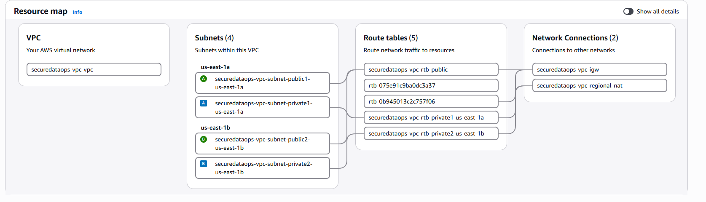

### Network access model

```text
Internet
   ↓
Frontend ALB → Frontend ECS

Internet
   ↓
Backend ALB → Backend ECS → PostgreSQL RDS
```

Security Groups control the allowed communication between these layers.

---

## ECS Fargate

Frontend and backend run as separate ECS services.

```text
ECS Cluster
├── Frontend Service
│   └── Frontend Task
│
└── Backend Service
    └── Backend Task
```

The services run on **AWS Fargate**, avoiding the need to manage EC2 servers.

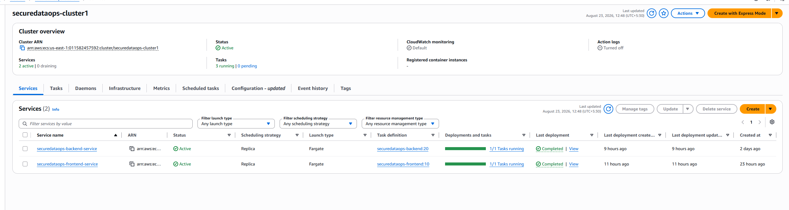

### Backend service

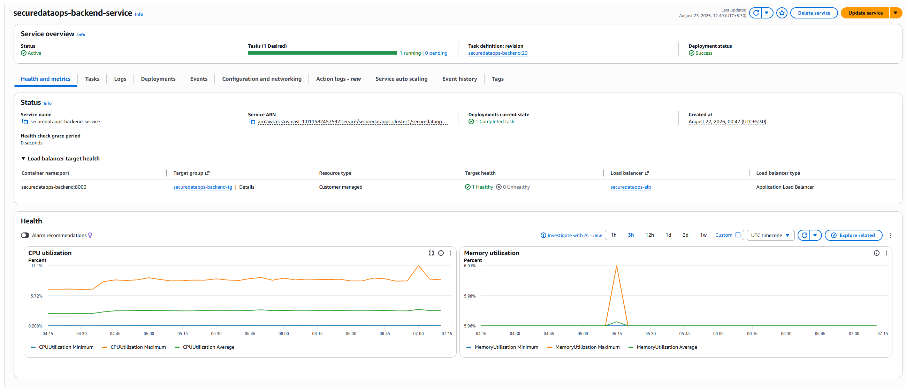

### Frontend service

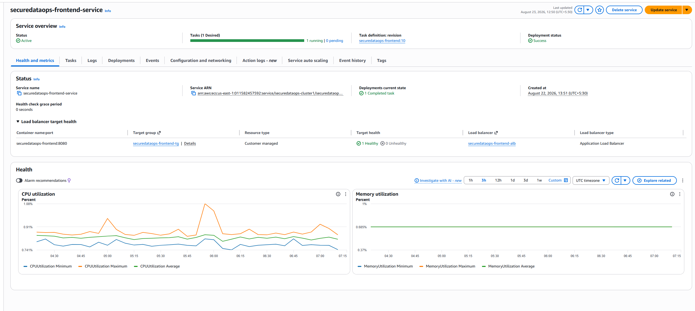

The deployed services were verified with the expected running task state.

---

## Application Load Balancing

Separate ALB/target-group paths are used for the frontend and backend.

```text
Frontend ALB
    ↓
Frontend Target Group
    ↓
Frontend ECS

Backend ALB
    ↓
Backend Target Group
    ↓
Backend ECS
```

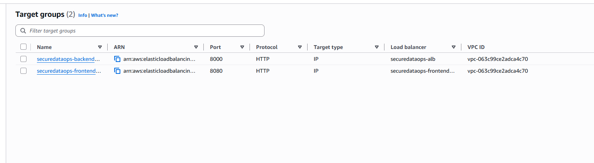

### Backend target group

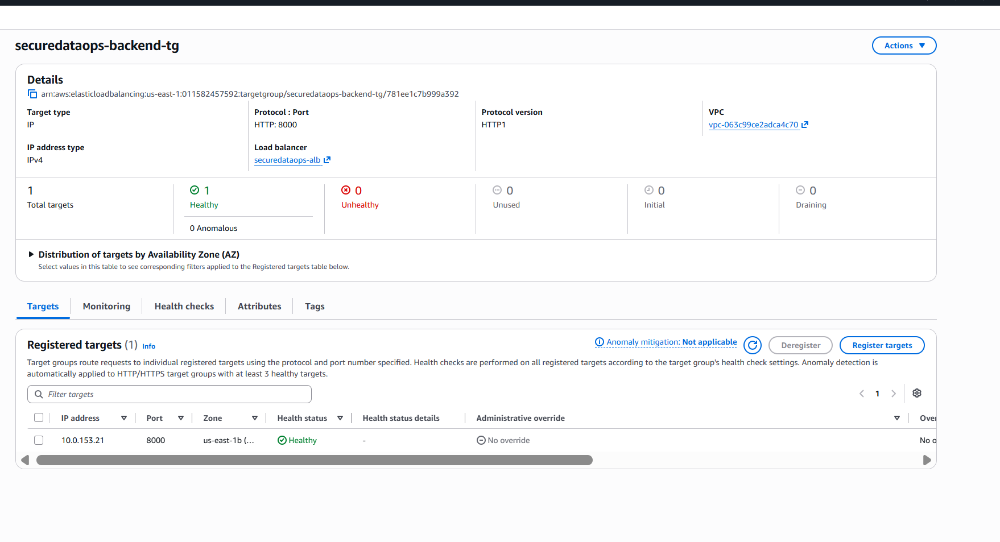

ALB health checks continuously evaluate whether ECS tasks are healthy enough to receive traffic.

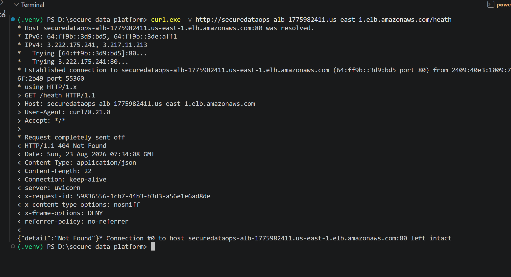

---

# Application

## Frontend

The frontend is implemented with **React/Vite** and deployed as a Dockerized ECS Fargate service.

Its responsibilities include the application UI and communication with the backend APIs.


## Backend

The backend is implemented with **FastAPI** and provides REST APIs for application operations, authentication, authorization, health checks, privacy operations, and database access.


## Database

The application uses **PostgreSQL on Amazon RDS** for persistent data.

The application stores user-related information such as:

- UUID
- Name
- Email
- Optional phone
- Timestamps

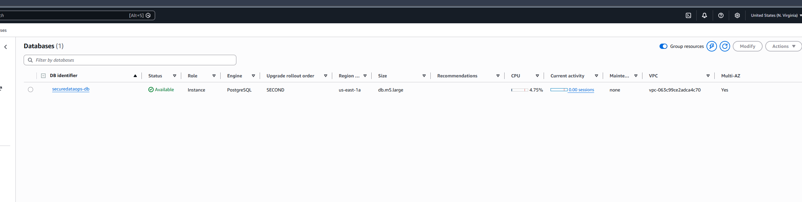

Verified database controls include:

- PostgreSQL
- Automated backup retention
- Encryption
- Multi-AZ
- Point-in-time recovery availability

---

# Request Flow

A normal backend request follows:

```text
User
 ↓
Backend ALB
 ↓
ALB Listener
 ↓
Backend Target Group
 ↓
Backend ECS Task
 ↓
FastAPI
 ↓
PostgreSQL RDS
 ↓
Response
```

The frontend follows:

```text
User Browser
 ↓
Frontend ALB
 ↓
Frontend Target Group
 ↓
Frontend ECS Task
 ↓
React Application
```

When the frontend needs application data, it communicates with the backend API, which then interacts with PostgreSQL.

---

# Containerization and ECR

Both application services are containerized with Docker.

```text
Application Source
      ↓
Docker Build
      ↓
Docker Image
      ↓
Amazon ECR
      ↓
ECS Task Definition
      ↓
ECS Fargate
```

Containerization provides reproducible environments, dependency isolation, consistent deployment artifacts, and easier rollback.

---

# Infrastructure as Code

Terraform is used to manage and validate infrastructure such as:

- ECS
- ECR
- ALB
- Target Groups
- IAM
- Application Auto Scaling
- Terraform state configuration

The normal workflow is:

```text
Terraform Code
    ↓
terraform fmt
    ↓
terraform validate
    ↓
terraform plan
    ↓
Review
    ↓
terraform apply
    ↓
AWS
```

### Terraform validation

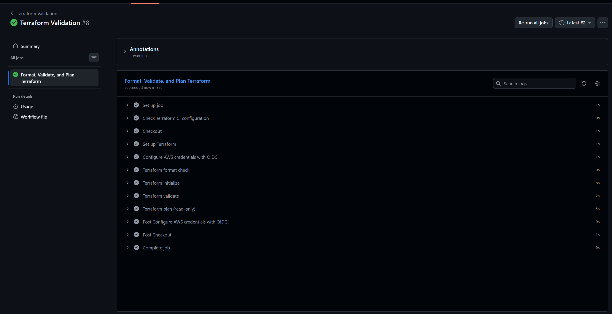

---

# Terraform State

Terraform state is stored remotely in Amazon S3.

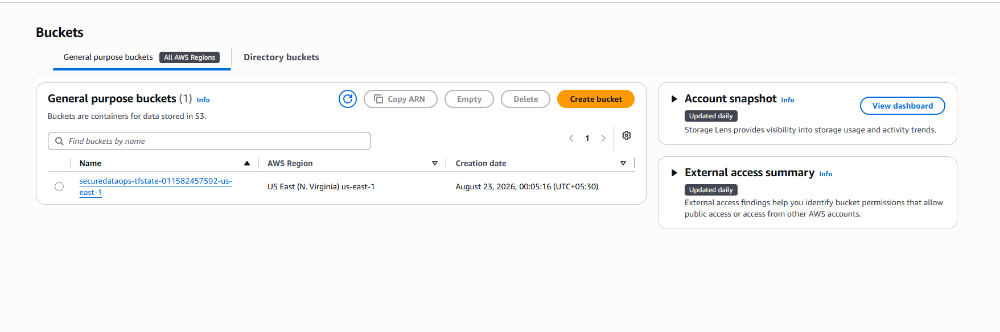

Verified controls include:

```text
S3 Versioning: Enabled
Encryption: AES256
Noncurrent version retention: 365 days
```

This protects the Terraform state from accidental loss and preserves historical state versions.

---

# CI/CD

GitHub Actions automates testing, security validation, Terraform validation, image building, and deployment.

### Backend CI/CD

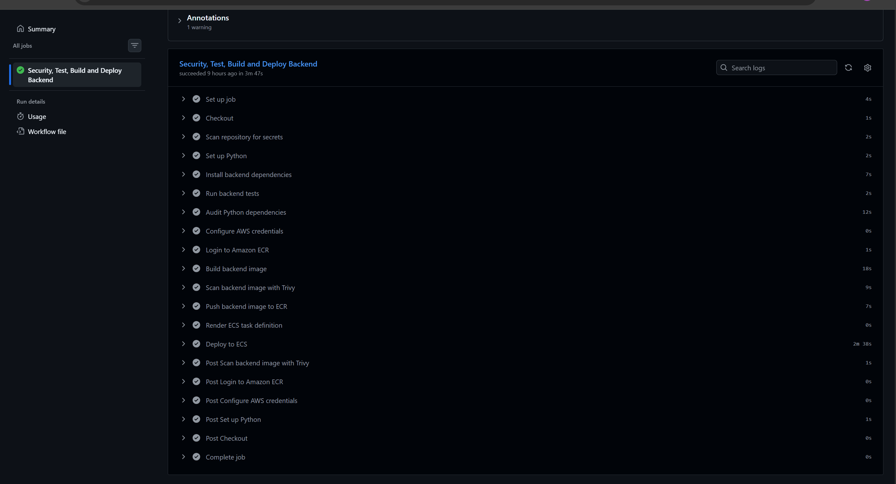

### Frontend CI/CD

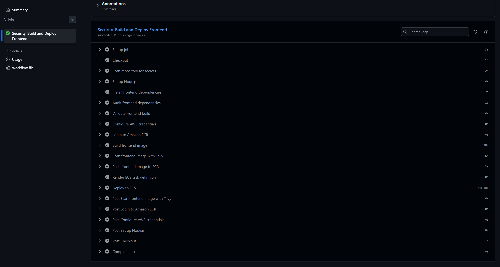

### Deployment flow

```text
Developer
   ↓
GitHub
   ↓
GitHub Actions
   ├── Tests
   ├── pip-audit
   └── Terraform validation
   ↓
Docker Build
   ↓
Amazon ECR
   ↓
Amazon ECS
   ↓
ALB Health Check
   ↓
Running Service
```

---

# GitHub OIDC and IAM

CI/CD uses **GitHub OIDC** rather than storing long-lived AWS access keys in the repository.

```text
GitHub Actions
      ↓
GitHub OIDC Token
      ↓
AWS IAM Trust Policy
      ↓
Deployment / Validation Role
      ↓
Temporary AWS Credentials
      ↓
AWS APIs
```

This reduces the need for permanent AWS credentials in CI/CD and supports a more secure deployment model.

---

# DevSecOps

Security is applied across development, CI/CD, and runtime.

```text
Code
 ↓
Tests
 ↓
Security Validation
 ↓
Terraform Validation
 ↓
Docker Build
 ↓
ECR
 ↓
ECS Runtime
```

Security-related controls include:

- IAM
- GitHub OIDC
- JWT authorization
- Dependency scanning
- Secure configuration
- RDS encryption
- S3 encryption
- Privacy-aware logging

## Dependency scanning

`pip-audit` is used to identify vulnerable Python dependencies.

During development, a vulnerable PyJWT version was identified, upgraded, and revalidated.

Final validation:

```text
26 tests passed
pip-audit: No known vulnerabilities found
```

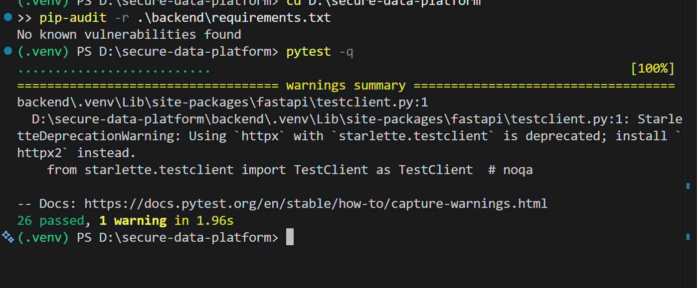

---

# Authentication and Authorization

Privacy-sensitive user endpoints require bearer JWT authorization.

Protected operations include:

```text
GET    /api/v1/users/{user_id}
GET    /api/v1/users/{user_id}/export
PUT    /api/v1/users/{user_id}
DELETE /api/v1/users/{user_id}
```

JWTs contain claims such as:

```text
sub
iss
aud
exp
```

Expected authorization behavior:

```text
Missing / invalid / expired token → 401
Cross-user access               → 403
Valid authorized request        → Allowed
```

---

# Observability

The platform uses CloudWatch for logs, metrics, dashboards, and alarms, with SNS for notifications.

```text
Application / ECS / ALB
          ↓
      CloudWatch
       ↓      ↓
     Logs   Alarms
              ↓
             SNS
              ↓
        Notification
```

### Logs

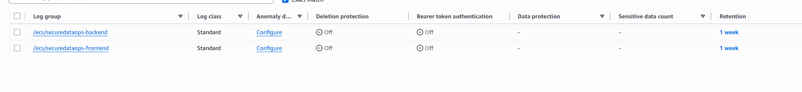

### Monitoring dashboard

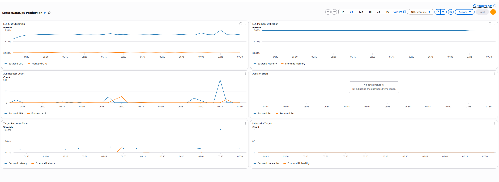

### Alerting

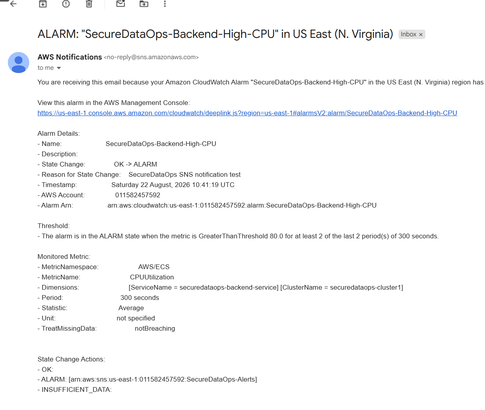

This creates an operational path from detection to notification instead of relying only on manual inspection.

---

# Auto Scaling

The backend ECS service uses Application Auto Scaling based on ALB request load.

### Verified configuration

| Configuration | Value |
|---|---:|
| Minimum capacity | 1 |
| Maximum capacity | 3 |
| Metric | `ALBRequestCountPerTarget` |
| Target | 100 |
| Scale-out cooldown | 60 seconds |
| Scale-in cooldown | 300 seconds |

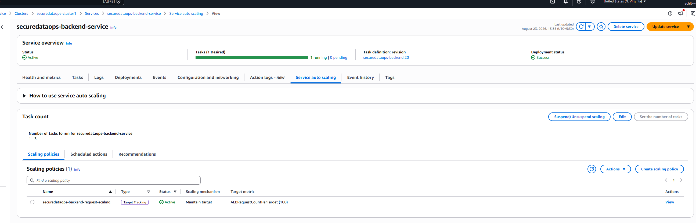

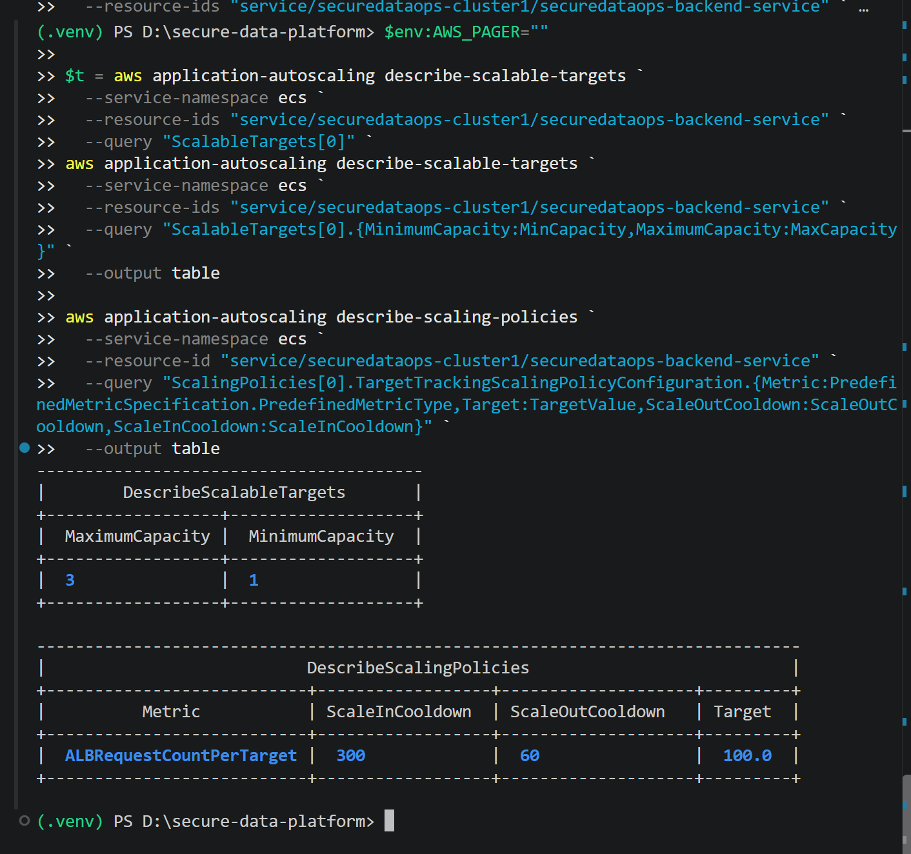

### Scaling flow

```text
Incoming Requests
      ↓
Backend ALB
      ↓
ALBRequestCountPerTarget
      ↓
Application Auto Scaling
      ↓
ECS Tasks
   ↙       ↘
Scale Out  Scale In
```

---

# Health and Reliability

The backend exposes:

```text
GET /health
```

Expected response:

```json
{
  "status": "healthy"
}
```

The production health endpoint and ALB target health were verified.

The ALB removes unhealthy targets from normal traffic, while ECS can replace unhealthy tasks.

---

# Backup and Disaster Recovery

RDS is treated as a critical stateful component.

```text
PostgreSQL RDS
      ↓
Automated Backups
      ↓
Point-in-Time Recovery
      ↓
Isolated Restore
      ↓
Validation
      ↓
Approved Recovery / Cutover
```

The Terraform state has an additional protection layer:

```text
Terraform
   ↓
S3
   ├── Encryption
   ├── Versioning
   └── 365-day noncurrent-version retention
```

Detailed recovery procedures are maintained in:

`docs/BACKUP-DR.md`

---

# DPDP-Oriented Privacy Controls

SecureDataOps processes personal data such as:

- Name
- Email
- Optional phone
- UUID
- Timestamps

The project implements engineering controls around the data actually processed by the application.

### Privacy operations

```text
Data Access
Data Export
Data Correction
Data Erasure
```

Protected operations include:

```text
GET    /api/v1/users/{user_id}/export
PUT    /api/v1/users/{user_id}
DELETE /api/v1/users/{user_id}
```

The project also uses:

- Authorization
- Minimal privacy audit events
- Privacy-aware logging
- Reduced logging of unnecessary personal data
- Data inventory and purpose mapping

Detailed documentation:

`docs/DPDP.md`

> **Important:** SecureDataOps demonstrates **DPDP-oriented engineering controls**. It is not a legal certification or a claim of complete DPDP compliance. Formal requirements such as lawful basis, notice/consent, retention, grievance handling, identity verification, and organizational procedures require appropriate legal review.

---

# Incident Management and SRE

The project treats operations as a continuous lifecycle:

```text
Detect
  ↓
Triage
  ↓
Mitigate
  ↓
Recover
  ↓
Validate
  ↓
Postmortem
  ↓
Prevent Recurrence
```

Operational documentation:

- `docs/incident-management.md`
- `docs/runbooks.md`
- `docs/slo.md`

### Example: unhealthy ECS task

```text
Task becomes unhealthy
        ↓
ALB health check fails
        ↓
Traffic removed
        ↓
ECS replaces task
```

### Example: increased traffic

```text
Traffic increases
        ↓
ALB request count increases
        ↓
Auto Scaling threshold reached
        ↓
Additional ECS task
```

### Example: vulnerable dependency

```text
Dependency
   ↓
pip-audit
   ↓
Vulnerability
   ↓
CI failure
   ↓
Upgrade dependency
   ↓
Tests + audit
   ↓
Pipeline passes
```

---

# Verification

The deployed environment was verified across application, infrastructure, security, and operations.

| Area | Verification |
|---|---|
| Backend tests | 26 passed |
| Dependency audit | No known vulnerabilities |
| Terraform | Validation passed |
| ECS | Services deployed |
| ALB | Targets healthy |
| Backend health | HTTP 200 |
| Auto Scaling | Verified |
| RDS backups | Verified |
| RDS encryption | Enabled |
| RDS Multi-AZ | Enabled |
| S3 versioning | Enabled |
| S3 encryption | Enabled |
| S3 lifecycle | 365-day retention |

---

# Repository Structure

```text
secure-data-platform/
│
├── backend/
│   ├── app/
│   ├── tests/
│   ├── Dockerfile
│   └── requirements.txt
│
├── frontend/
│   ├── src/
│   ├── Dockerfile
│   └── ...
│
├── infra/
│   └── terraform/
│
├── docs/
│   ├── BACKUP-DR.md
│   ├── DPDP.md
│   ├── incident-management.md
│   ├── runbooks.md
│   ├── slo.md
│   └── images/
│
├── .github/
│   └── workflows/
│
└── README.md
```

---

# Documentation

| Document | Purpose |
|---|---|
| `docs/DPDP.md` | DPDP-oriented privacy controls |
| `docs/BACKUP-DR.md` | Backup and disaster recovery |
| `docs/incident-management.md` | Incident lifecycle |
| `docs/runbooks.md` | Operational troubleshooting |
| `docs/slo.md` | Reliability targets |
| `infra/terraform/README.md` | Infrastructure documentation |

---

# Local Development

## Backend

```bash
cd backend
python -m venv venv
```

Windows:

```powershell
venv\Scripts\activate
```

Install dependencies:

```bash
pip install -r requirements.txt
```

Run:

```bash
uvicorn app.main:app --reload
```

## Frontend

```bash
cd frontend
npm install
npm run dev
```

## Docker

Backend:

```bash
docker build -t securedataops-backend ./backend
```

Frontend:

```bash
docker build -t securedataops-frontend ./frontend
```

---

# Production Readiness Considerations

The project demonstrates production-oriented engineering practices, but a real enterprise deployment may require additional controls depending on business and regulatory requirements.

Potential future improvements include:

- Managed enterprise identity provider
- Asymmetric/JWKS-backed JWT validation
- Formal secret rotation
- HTTPS/TLS everywhere
- AWS WAF
- Stronger private-network isolation
- Centralized security monitoring
- Formal penetration testing
- Regular DR restore exercises
- Multi-region recovery where required
- Cost monitoring and optimization

These are intentionally presented as future considerations rather than claimed as already implemented.

---

# What This Project Demonstrates

### AWS / Cloud

VPC · Subnets · Security Groups · ALB · ECS Fargate · ECR · RDS · S3 · IAM · CloudWatch · SNS

### DevOps

Docker · GitHub · GitHub Actions · Terraform · CI/CD · Infrastructure as Code

### DevSecOps

OIDC · IAM · JWT · Authorization · Dependency Scanning · Secure Configuration

### SRE

Health Checks · Monitoring · Alerting · Auto Scaling · SLOs · Incident Management · Runbooks · Backup/DR

### Data Protection

Data Inventory · Export · Correction · Erasure · Auditability · DPDP-oriented Controls

---

# Project Philosophy

```text
Build
 ↓
Automate
 ↓
Secure
 ↓
Deploy
 ↓
Observe
 ↓
Scale
 ↓
Recover
 ↓
Improve
```

SecureDataOps demonstrates that production-oriented DevOps is not simply about getting an application running. It is about making the system **automated, observable, secure, scalable, recoverable, and maintainable**.

---

# Author

**Rachit Singh Chauhan**

B.Tech — Computer Science (AI & ML)

**Interests:** DevOps · SRE · DevSecOps · AWS · Cloud Infrastructure · IaC · CI/CD · AI/ML Systems
